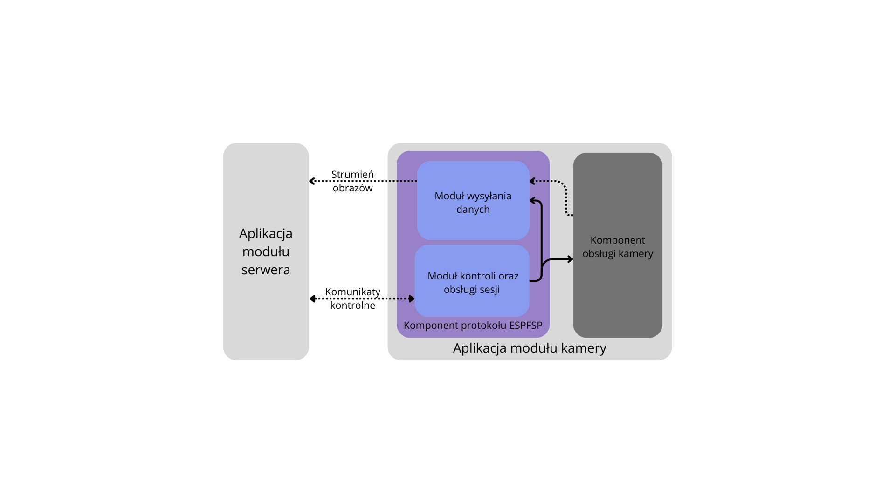

# Home Monitoring System Camera

## Description

This project focuses on the implementation of one of the three components of a monitoring system - camera component. The system is based on the ESPFSP protocol, which facilitates hosting the camera and provides access to it through an ESPFSP protocol.

Camera is placed in a local network, the same as server newtork. The module, based on the ESP32, is equipped with a camera that captures real-time images and communicates with the server module. It receives control messages from the server module to configure camera and image stream parameters, and also sends the image stream to the server.

## Functionalities

The camera module is designed to provide core functionality for the monitoring system, focusing on flexibility and ease of integration. Its main functionalities include:

1. Video Stream Hosting: The module captures video using the esp32-camera component and streams it to the server via the ESPFSP protocol, enabling real-time monitoring.

2. Camera Parameter Configuration: Users can remotely configure camera settings depending on the selected camera module.

3. Stream Parameter Configuration: Users can remotely configure stream settings.

4. Access Point (AP) Mode: The module includes an AP mode to simplify initial setup and connection to a local network, allowing users to configure Wi-Fi settings directly through the module.

5. Modular Camera Support: Built on the esp32-camera component, the module is highly adaptable and supports various camera modules, making it easy to customize the project for different hardware requirements.

## Requirements

1. Development Environment: ESP-IDF (Espressif IoT Development Framework) must be installed and configured on your system.

2. ESPFSP Project: The camera project relies on the ESPFSP protocol, so the corresponding ESPFSP project must be included in the build.

3. Hardware:

    - ESP32 Module with Camera: A module like ESP32-CAM is recommended, but other ESP32-based camera modules can also be used.
    - USB Cable: Required for flashing the firmware and powering the ESP32 module.

4. Drivers: Ensure the appropriate USB-to-serial drivers for the ESP32 module (e.g., CP210x or CH340) are installed on your computer.

## Author

Maksymilian Komarnicki – [GitHub](https://github.com/makz00).

## Licencja

...
